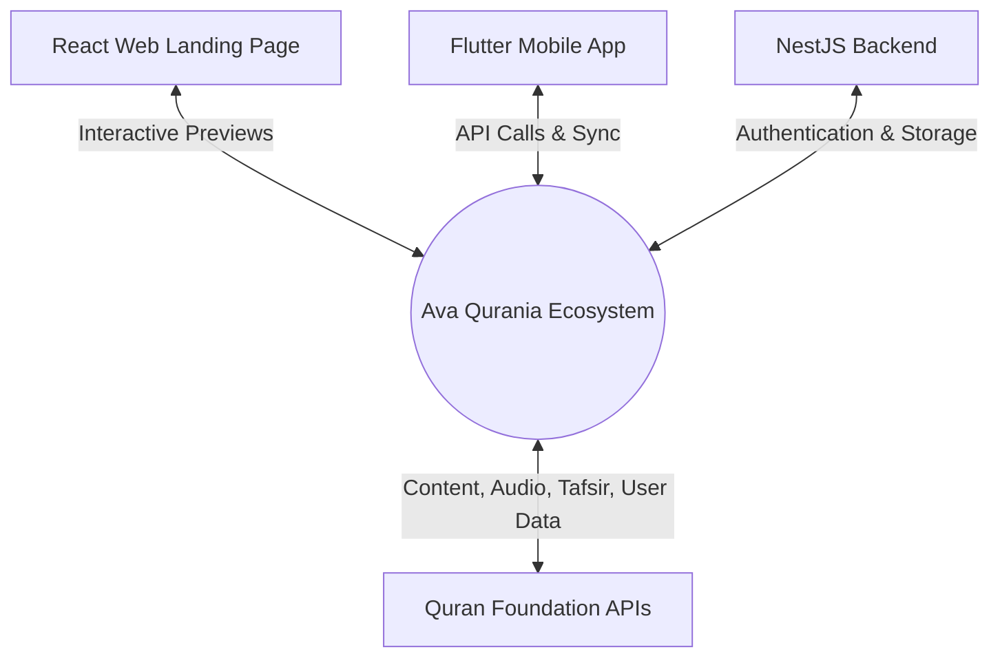

# 🌟 Ava Qurania — Sacred Stillness in Every Verse

[](https://launch.provisioncapital.com/quran-hackathon)
[](https://flutter.dev)
[](https://react.dev)
[](https://nestjs.com)

> **Ava Qurania** is an all-in-one modern, high-fidelity Islamic engagement ecosystem built for the **Quran Foundation Hackathon 2026**. It solves the post-Ramadan spiritual drop-off by combining **immersive, distraction-free Quranic study (Tafsir & audio)** with **short-form Islamic Reels (micro-reflections)** and **gamified habit loops (Streaks & Goals)**.

---

## 📖 Table of Contents
- [✨ The Inspiration & Challenge](#-the-inspiration--challenge)
- [📱 Core Features](#-core-features)
- [🔌 Quran Foundation API Integration (Technical Requirements)](#-quran-foundation-api-integration-technical-requirements)
- [🏗️ Ecosystem Architecture](#%EF%B8%8F-ecosystem-architecture)
- [🎨 Design Aesthetics & UI/UX](#-design-aesthetics--uiux)
- [🛠️ Setup & Installation](#%EF%B8%8F-setup--installation)
- [🏆 Hackathon Scoring Alignment](#-hackathon-scoring-alignment)

---

## ✨ The Inspiration & Challenge

Millions of Muslims build a deep, powerful connection with the Quran during Ramadan. However, once the holy month ends, maintaining this habit becomes challenging amidst busy routines.

**Ava Qurania** bridges this spiritual gap by making Quranic interaction frictionless, highly engaging, and naturally integrated into daily life. It does this through two main pillars:
1. **Micro-Learning via Islamic Reels:** Capturing the attention of the modern generation by delivering short, inspiring Quranic reflections and reminders in a vertical video format.
2. **Deep Continuous Study:** Instantly transitioning from a vertical Reel to full-length **Quranic verses**, authentic **Tafsir translation/explanations**, and relaxing **audio recitations** in a single tap.

---

## 📱 Core Features

### 🎥 1. Infinite Islamic Reels (Micro-Reflections)
*   A premium, native vertical video player simulating TikTok/Instagram Reels.
*   Presents bite-sized Quranic reflections, historical stories, and serene du'as.
*   Enables sharing reflections instantly with friends or saving them for offline contemplation.

### 🎧 2. Immersive Audio Player & Recitations
*   A beautiful floating background audio player simulating the premium look and feel of modern players.
*   Stream high-quality audio recitations from the world's most beloved reciters.
*   Features offline playback caching, play progress tracking, and customizable recitation speed.

### 📚 3. Authentic Tafsir & Multi-Translation Reader
*   Deepen comprehension by accessing scholarly Tafsir commentary (scholarly explanations of the holy text).
*   Toggle between legal, linguistic, hadith-critical, and rhetorical tafsirs instantly.
*   Support for multiple languages to ensure globally inclusive Quranic study.

### 🔥 4. Habit-Building Streak & Goals Tracker
*   Gamified streak tracker and activity calendar encouraging consistent daily readings.
*   Customizable reading goals (pages/verses per day) that send soft push notifications to remind users.

### 🕌 5. Prayer Times & Notifications
*   Accurate, location-based daily prayer times.
*   Customizable Adhan notifications to keep the user anchored to their five daily prayers.

### 🤝 6. Social Discovery & Community
*   Discover and follow scholars, reciters, or friends.
*   See what your network is reading and sharing, fostering a supportive spiritual community.

---

## 🔌 Quran Foundation API Integration (Technical Requirements)

Ava Qurania fully satisfies the hackathon technical requirements by heavily integrating APIs from both the **Content** and **User** categories:

### 🟢 1. Content APIs (Quran Foundation / Quran MCP)
*   **Quran APIs (`/chapters`, `/verses`):** Used to fetch and render exact canonical Arabic text of Surahs, verse translations, and word-by-word diacritics.
*   **Audio APIs (`/reciters`, `/audio_files`):** Feeds the floating audio player with verified high-quality reciter profiles and audio stream resources.
*   **Tafsir APIs (`/tafsirs`):** Fuels the in-depth Tafsir reader with rich scholarly commentary, allowing users to select their preferred Mufassir.
*   **Post APIs (Lessons & Reflections):** Provides structural template resources and context cards used to construct cards and reels content.

### 🔵 2. User APIs
*   **Bookmarks & Collections APIs:** Allows users to bookmark verses, keep custom collections (e.g., "Du'as for Patience", "Verses of Comfort"), and sync them across devices.
*   **Streak Tracking APIs:** Connects to the backend user profile to calculate daily streaks, session times, and render the progress dashboard.
*   **Goals & Activity APIs:** Updates the user's daily goals status and counts active minutes spent reading or listening.
*   **Reflection Posting APIs:** Allows creators and scholars to submit micro-reflections/Reels back to the community feed.

---

## 🏗️ Ecosystem Architecture

The Ava Qurania ecosystem consists of three unified sub-projects:



### 1. 📱 Flutter Mobile Application (`/avaquran_app`)
*   **Main tech:** Flutter (Dart), State management, Background Audio Services.
*   **Role:** The core user interface providing immersive Quran reading, floating audio controls, Reels viewing, and progress streaks.

### 2. 💻 React Web Landing Page (`/Landing`)
*   **Main tech:** React 18, Vite, Tailwind CSS.
*   **Role:** The marketing and acquisition hub designed to showcase app features, featuring an interactive audio player simulator, Surah explorer, and an **infinite vertical Reels preview grid** that encourages immediate app downloads.

### 3. ⚙️ Secure NestJS Backend
*   **Main tech:** NestJS (Node.js), Docker, PostgreSQL, SSL with Reverse Proxy.
*   **Role:** Handles local user accounts, securely coordinates the **OAuth2 authorization exchange** with the Quran Foundation, manages social graphs (following/discovering), and curates custom user collections/playlists.

---

## 🎨 Design Aesthetics & UI/UX

Ava Qurania employs a bespoke, premium design language centered around **Sacred Stillness** and **Tranquility**:

*   **Colors:** Curated, soothing palette featuring soft mint greens (`--color-primary`), cream whites, and elegant dark accents that eliminate eye strain during late-night readings.
*   **Aesthetics:** Uses modern design methodologies including smooth gradients, glassmorphism, subtle micro-animations (e.g., rotating play badges, scaling hover states), and sacred drop shadows.
*   **Typography:** Anchored on *Plus Jakarta Sans* and *Manrope* for sharp, readable modern headings and body copy, combined with beautiful Arabic calligraphic fonts for holy verses.

---

## 🛠️ Setup & Installation

### Prerequisite
*   Flutter SDK (v3.22.0 or higher)
*   Node.js (v18.0.0 or higher)
*   Docker & Docker Compose

### 🖥️ 1. Running the Web Landing Page
```bash
cd Landing
npm install
npm run dev
```
Open `http://localhost:5173` in your browser.

### 📱 2. Running the Flutter App
Make sure a physical device or emulator is connected:
```bash
cd avaquuran_app
flutter pub get
flutter run
```

---

## 🏆 Hackathon Scoring Alignment

Ava Qurania was built explicitly around the official **100-point judging criteria**:

1.  **Impact on Quran Engagement (30 pts):** Direct, powerful engagement. Reels catch short attention spans and draw users into the app, while streaks and custom goals build lasting daily habits.
2.  **Product Quality & UX (20 pts):** World-class, premium UI/UX. The responsive design, gorgeous color palette, smooth transition animations, and dark-mode compatibility offer an outstanding user experience.
3.  **Technical Execution (20 pts):** Fully production-ready. The Flutter app compiles smoothly into a release APK, features robust state management, and is backed by a secure, containerized NestJS server.
4.  **Innovation & Creativity (15 pts):** Combines the traditional Quran study experience with modern vertical content consumption (Islamic Reels) to capture the next generation of users.
5.  **Effective Use of APIs (15 pts):** Deeply utilizes multiple Content APIs (Quran text, Recitations, Tafsirs) and User APIs (Bookmarks, Goals, Streaks) from the Quran Foundation ecosystem.

---

*Developed with devotion and built to inspire. Ava Qurania brings sacred stillness to the modern era.*
